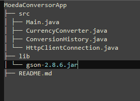

# 💱 Conversor de Moedas

## 📋 Descrição do Projeto

Este é um projeto de conversor de moedas que permite ao usuário converter valores entre diferentes moedas utilizando a API "Exchange Rate API" para obter taxas de câmbio em tempo real. O projeto foi desenvolvido como parte do Programa ONE e visa demonstrar habilidades em Java, manipulação de JSON com Gson e interação com APIs HTTP.

## ✨ Funcionalidades

- 🚀 Conversão de moedas entre várias opções, incluindo USD, ARS, BRL, COP, EUR, GBP, entre outras.
- 📝 Exibição do histórico das últimas conversões realizadas.
- 💻 Interface de usuário textual interativa via console.

## 🛠️ Tecnologias Utilizadas

- ☕ Java
- 🌐 API "Exchange Rate API"
- 📦 Biblioteca Gson para manipulação de JSON
- 📡 Biblioteca `java.net.http` para fazer requisições HTTP
- ⏰ Biblioteca `java.time` para manipulação de data e hora

## 📦 Pré-requisitos

- Java 11 ou superior
- Biblioteca Gson (adicionar o arquivo JAR ao classpath)

## 🚀 Como Executar o Projeto

1. **Clone o repositório:**
    ```sh
    git clone https://github.com/Jeferson-Labout/Challenge-BackEnd-ONE.git
    ```
2. **Navegue até o diretório do projeto:**
    ```sh
    cd Challenge-BackEnd-ONE
    ```
3. **Compile as classes:**
    ```sh
    javac -cp lib/gson-2.8.6.jar src/*.java -d out
    ```
4. **Execute a aplicação:**
    ```sh
    java -cp "out;lib/gson-2.8.6.jar" Main
    ```

## 💻 Exemplo de Uso

Após executar a aplicação, o usuário verá um menu com opções para selecionar a conversão desejada. O usuário deve inserir a opção numérica e, em seguida, o valor a ser convertido. A aplicação exibirá o valor convertido e adicionará a conversão ao histórico.

### Menu Inicial


## 🗂️ Estrutura do Projeto




## 🤝 Contribuições

Contribuições são bem-vindas! Sinta-se à vontade para abrir uma _issue_ ou enviar um _pull request_.

## 📄 Licença

Este projeto está licenciado sob a licença MIT. Veja o arquivo [LICENSE](LICENSE) para mais detalhes.


## 📧 Contato

Para qualquer dúvida, entre em contato:

- Nome: Jeferson Labout
- Email: jefson1989@gmail.com
- GitHub: [Jeferson-Labout](https://github.com/Jeferson-Labout)
'
